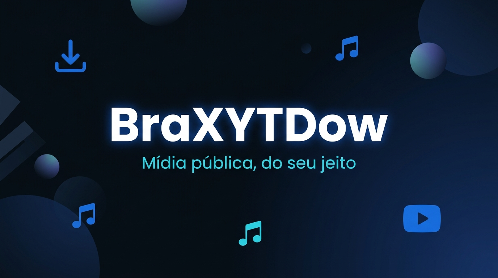
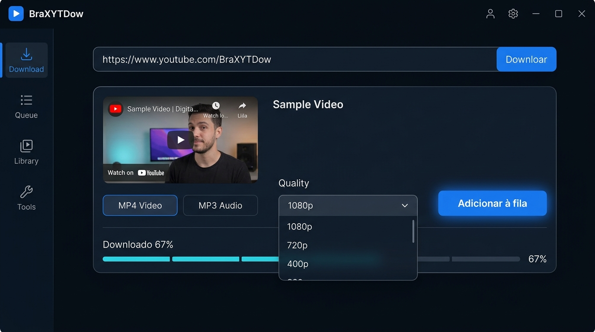

<div align="center">



<br/>

# 🎬 BraXYTDow 3.2

**Mídia pública, do seu jeito.**

Aplicativo desktop para Windows que baixa vídeos, áudios e playlists com interface moderna, fila inteligente e atualização automática de ferramentas.

<br/>

[](https://github.com/RichardXLR/BraXYTDown/releases)
[](https://www.python.org/)
[](https://doc.qt.io/qtforpython/)
[](https://github.com/RichardXLR/BraXYTDown)
[](https://github.com/RichardXLR/BraXYTDown)

<br/>

[📥 Download](#-instalação) · [✨ Funcionalidades](#-funcionalidades) · [🛠️ Desenvolvimento](#-executar-em-desenvolvimento) · [📖 Documentação](#-arquitetura)

</div>

<br/>

---

<br/>

## 📸 Preview

<div align="center">


<br/>
<sub>Interface principal com tema dark, sidebar de navegação e prévia de mídia</sub>
</div>

<br/>

---

<br/>

## ✨ Funcionalidades

<table>
<tr>
<td width="50%">

### 🎥 Download Inteligente
- Vídeos em até **4K** com seleção de formato
- Áudio em **MP3, M4A, OPUS** com bitrate configurável
- **Playlists completas** com filtros e sincronização
- Capítulos selecionáveis e corte por trecho
- Download simultâneo com **1–4 threads**

</td>
<td width="50%">

### 📋 Fila & Biblioteca
- Fila **reordenável** com prioridade e agendamento
- Edição em lote (destino, qualidade, limites)
- Biblioteca permanente com busca e filtros
- Detecção de arquivos movidos/apagados
- Sincronização de playlists (somente novos itens)

</td>
</tr>
<tr>
<td width="50%">

### 🔧 AutoCura 2.0
- Atualização **atômica** de yt-dlp, FFmpeg e Deno
- Verificação com vídeos-canários do YouTube
- **Rollback automático** em caso de falha
- Quarentena de versões incompatíveis
- Central de Compatibilidade com testes manuais

</td>
<td width="50%">

### 🛡️ Segurança & Privacidade
- Validação **SHA-256** em todas as atualizações
- Verificação **Authenticode** em releases
- Plugins PO Token em sandbox com allowlist
- Cookies nunca copiados para DB/logs
- Dados 100% locais em `%LOCALAPPDATA%`

</td>
</tr>
<tr>
<td width="50%">

### 🎨 Interface Premium
- Tema **dark midnight** com acentos cobalt/cyan
- Animações suaves e transições cross-fade
- Modo **compacto** always-on-top
- Bandeja do sistema com toast nativo
- Ícones vetoriais renderizados em tempo real

</td>
<td width="50%">

### ♿ Acessibilidade
- Alto contraste e texto ampliado
- Redução de movimento
- Atalhos globais (`Ctrl+L`, `Ctrl+J`, `Ctrl+1..4`)
- Layout responsivo (3 breakpoints)
- Editor de metadados, capa e nome

</td>
</tr>
</table>

<br/>

---

<br/>

## 🏗️ Arquitetura

```
┌─────────────────────────────────────────────────────────┐
│                     app.py                               │
│           Bootstrap Qt · Single-instance Lock            │
└──────────────────────┬──────────────────────────────────┘
                       │
                       ▼
┌──────────────────────────────────────────────────────────┐
│                    ui.py (GUI)                            │
│   MainWindow · Pages · Dialogs · System Tray · Motion    │
└──────────┬──────────────────────────────┬───────────────┘
           │                              │
           ▼                              ▼
┌────────────────────┐      ┌──────────────────────────┐
│    Analyzer        │      │    DownloadManager       │
│  (Metadata fetch)  │      │  (Queue · Jobs · Retry)  │
└────────┬───────────┘      └──────────┬───────────────┘
         │                             │
         ▼                             ▼
┌────────────────────┐      ┌──────────────────────────┐
│   parsers.py       │      │     DownloadJob          │
│  JSON · Progress   │      │  (Process · PostProcess)  │
└────────────────────┘      └──────────┬───────────────┘
                                       │
                                       ▼
                            ┌──────────────────────────┐
                            │   command_builder.py     │
                            │  (yt-dlp CLI arguments)   │
                            └──────────┬───────────────┘
                                       │
                                       ▼
                            ┌──────────────────────────┐
                            │   paths.py · storage.py  │
                            │  (Binaries · SQLite DB)   │
                            └──────────────────────────┘
```

<br/>

### 📁 Estrutura do Projeto

```
BraXYTDown/
├── 📂 baixatube/                 # Pacote principal do aplicativo
│   ├── app.py                    # Entry point — bootstrap Qt
│   ├── ui.py                     # Interface completa (4.200+ linhas)
│   ├── service.py                # Analyzer + DownloadManager + Jobs
│   ├── storage.py                # SQLite — settings, queue, history
│   ├── command_builder.py        # Construtor de comandos yt-dlp
│   ├── parsers.py                # Parser de JSON e progresso
│   ├── models.py                 # Dataclasses e enums do domínio
│   ├── paths.py                  # Paths, binários e manifesto
│   ├── motion.py                 # Animações e transições
│   ├── icons.py                  # Ícones vetoriais (22 glyphs)
│   ├── compatibility.py          # Canários e AutoCura
│   ├── tool_updates.py           # Atualizador de ferramentas
│   ├── app_updates.py            # Auto-update do aplicativo
│   ├── update_controller.py      # Orquestrador Qt de updates
│   ├── cookie_auth.py            # Sessão com cookies
│   ├── plugin_security.py        # Sandbox de plugins PO Token
│   ├── network_policy.py         # Conexão limitada e bandwidth
│   ├── process_tree.py           # Win32 Job Objects
│   ├── windows_toast.py          # Notificações toast nativas
│   ├── diagnostics.py            # Logging rotativo
│   ├── library_cleanup.py        # Limpeza de parciais/duplicados
│   ├── release_integrity.py      # Verificação Authenticode
│   ├── branding.py               # Identidade e créditos
│   └── utils.py                  # Helpers gerais
├── 📂 tests/                     # 19 arquivos de testes
├── 📂 scripts/                   # Build, assinatura e distribuição
├── 📂 assets/                    # Ícones, imagens e SVGs
├── 📂 installer/                 # Inno Setup config
├── 📂 .github/workflows/         # CI/CD pipeline
├── pyproject.toml                # Configuração do projeto
├── requirements.txt              # Dependência: PySide6
└── README.md                     # Este arquivo
```

<br/>

---

<br/>

## 📥 Instalação

### Opção 1: Executável (Recomendado)

Baixe a versão mais recente na [página de releases](https://github.com/RichardXLR/BraXYTDown/releases):

| Formato | Descrição |
|---------|-----------|
| `BraXYTDow.exe` | EXE único — sem dependências |
| `BraXYTDow-3.2.0-windows-x64.zip` | Pacote portátil — inicialização mais rápida |
| `BraXYTDow-Setup-3.2.0-x64.exe` | Instalador por usuário |

### Opção 2: Código-fonte

```powershell
# Clonar o repositório
git clone https://github.com/RichardXLR/BraXYTDown.git
cd BraXYTDown

# Criar ambiente virtual
py -3 -m venv .venv
.\.venv\Scripts\Activate.ps1

# Instalar dependências
python -m pip install -r requirements-dev.txt

# Preparar binários (yt-dlp, FFmpeg, Deno)
powershell -ExecutionPolicy Bypass -File scripts\prepare_binaries.ps1

# Executar o aplicativo
python -m baixatube
```

<br/>

---

<br/>

## 🧪 Testes

```powershell
.\.venv\Scripts\python.exe -m pytest
```

> Os testes usam respostas locais e bancos temporários — **não dependem do YouTube**.

<br/>

---

<br/>

## 📦 Build da Release

```powershell
# Build padrão (valida ferramentas, roda testes, gera EXE + ZIP)
powershell -ExecutionPolicy Bypass -File scripts\build.ps1

# Build offline com venv e binários já preparados
powershell -File scripts\build.ps1 -Offline

# Build completo com instalador
powershell -File scripts\build.ps1 -RequireInstaller
```

### Artefatos gerados

| Arquivo | Descrição |
|---------|-----------|
| `dist\BraXYTDow.exe` | EXE único PyInstaller |
| `dist\BraXYTDow-3.2.0-windows-x64.zip` | Pacote portátil |
| `dist\installer\BraXYTDow-Setup-3.2.0-x64.exe` | Instalador Inno Setup |
| `dist\BraXYTDow-sbom.cdx.json` | SBOM CycloneDX |
| `dist\SHA256SUMS.txt` | Checksums de integridade |

<br/>

---

<br/>

## 🔒 Segurança & Privacidade

- 🔐 **Atualizações verificadas** — SHA-256 + Authenticode + tamanho exato
- 🍪 **Cookies opcionais** — nunca copiados, apenas referenciados por path
- 🧩 **Plugins sandboxed** — allowlist, quarentena, teste funcional obrigatório
- 💾 **Dados locais** — tudo em `%LOCALAPPDATA%\BraXYTDow`
- 🚫 **Zero telemetria** — nenhum dado enviado para servidores externos

<br/>

---

<br/>

## ⚖️ Uso Responsável

> Use apenas conteúdo próprio, em domínio público ou para o qual você tenha autorização. Cookies opcionais apenas reutilizam uma sessão local legítima: eles não concedem direitos sobre obras, não removem DRM e não devem ser usados para violar direitos autorais ou controles de acesso.

<br/>

---

<br/>

## 🧰 Ferramentas Externas

O BraXYTDow utiliza as seguintes ferramentas como processos externos:

| Ferramenta | Função | Atualização |
|-----------|--------|-------------|
| [yt-dlp](https://github.com/yt-dlp/yt-dlp) | Extração e download de mídia | Nightly (padrão) ou Stable |
| [FFmpeg](https://ffmpeg.org/) | Conversão, merge e pós-processamento | Via Gyan.dev builds |
| [Deno](https://deno.com/) | Execução de JavaScript (EJS) | Via Denoland releases |

> Todas são verificadas por SHA-256 antes da ativação. Consulte [`THIRD_PARTY_NOTICES.md`](THIRD_PARTY_NOTICES.md) para licenças.

<br/>

---

<br/>

<div align="center">

## 👨‍💻 Criador


### Richard Ittou

*Criador e desenvolvedor do BraXYTDow*

[](https://www.instagram.com/richard.ittou?igsh=c210bHhzdzJwcWg1)
[](https://discord.com)

<br/>

---

<sub>Feito com 💙 no Brasil · BraXYTDow v3.2.0</sub>

</div>
